# Hey, soy Gustavo 👋

Soy un estudiante de ingenieria en sistemas, me gusta crear cosas herramientas utiles como librerias para entornos Node.js hasta apps desktop multiplataforma open sources que sean funcionales 

---

## 🛠️ Tecnologías y lenguajes

## ⚙️ Herramientas y entornos

---

## 📦 Proyectos destacados

| Proyecto | Descripción | Lenguaje |
|---|---|---|
| [Json-Error-Logger](https://github.com/Gxstavo-dev/Json-Error-Logger) | Librería ligera y asíncrona para capturar errores en Node.js en formato JSON | JavaScript |
| [Quick-sqlite](https://github.com/Gxstavo-dev/Quick-sqlite) | Consultas SQLite simplificadas para Node.js con protección contra SQL injection | JavaScript |
| [spent](https://github.com/Gxstavo-dev/spent) | App desktop de gestión de gastos con Tauri + TypeScript + SQLite | TypeScript / Rust |
| [Void-notas](https://github.com/Gxstavo-dev/Void-notas) | Aplicación desktop de notas con Python y webview | Python / JS |
| [Task-java-cli](https://github.com/Gxstavo-dev/Task-java-cli) | CLI de tareas almacenadas en .txt hecho en Java | Java |

---

## 📊 Estadísticas

---

